<div align="center">


</div>

---

<div align="center">


</div>

---

<div align="center">


</div>

---

## `// 01` · OVERVIEW

<div align="center">

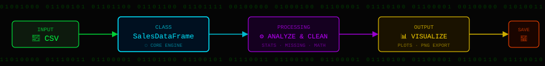

</div>

> A comprehensive **Sales Data Analysis & Visualization** tool built in Python.
> Encapsulates all data science operations inside a single `SalesDataFrame` class —
> from raw CSV ingestion to advanced statistical analysis, multi-library visualization,
> and interactive menu-driven user interface. Built for academic excellence and real-world applicability.

---

## `// 02` · FEATURES

<div align="center">

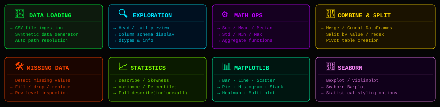

</div>

---

## `// 03` · VISUALIZATION GALLERY

<div align="center">



</div>

---

## `// 04` · CLASS ARCHITECTURE

<div align="center">

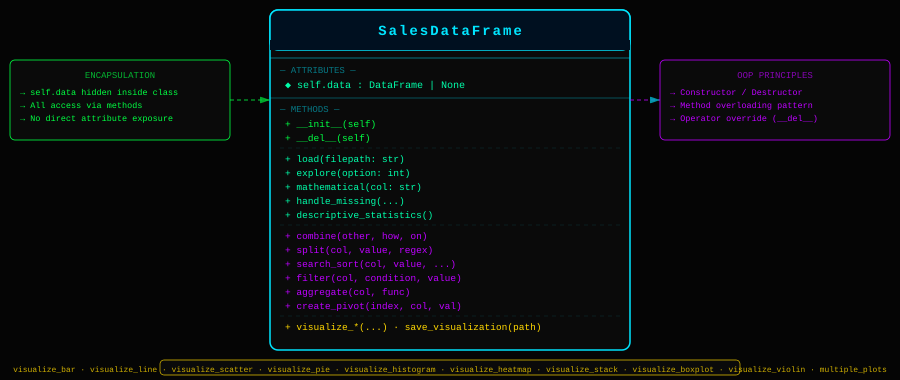

</div>

---

## `// 05` · TECH STACK

<div align="center">

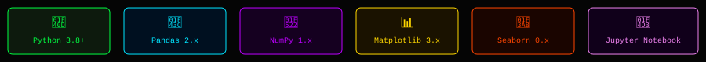

</div>

---

## `// 06` · DATASET SCHEMA

<div align="center">

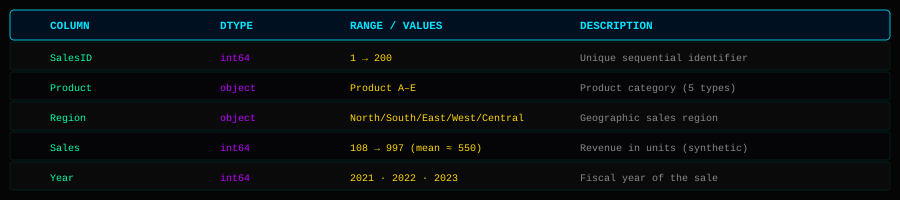

</div>

---

## `// 07` · INSTALLATION

```bash
# Navigate to project directory
cd visualizer/

# Install dependencies
pip install pandas numpy matplotlib seaborn jupyter

# Run the CLI program
python sales_data_analyzer.py

# Launch Jupyter Notebook
jupyter notebook sales_data_analyzer.ipynb
```

---

## `// 08` · CONSOLE INTERACTION

<div align="center">


</div>

---

## `// 09` · PROJECT STRUCTURE

```
visualizer/
│
├── 📓 sales_data_analyzer.ipynb    ← Jupyter Notebook (cell-by-cell execution)
├── 🐍 sales_data_analyzer.py       ← CLI Python program (menu-driven)
│
├── 📁 assets/                      ← SVG graphic assets for README
│   ├── header.svg
│   ├── metrics.svg
│   ├── pipeline.svg
│   ├── features.svg
│   ├── charts_row1.svg
│   ├── charts_row2.svg
│   ├── architecture.svg
│   ├── techstack.svg
│   ├── schema.svg
│   ├── terminal.svg
│   ├── flow.svg
│   ├── oop.svg
│   └── footer.svg
│
└── 📁 data/
    └── 📄 sales_data.csv           ← Synthetic dataset (200 rows × 5 cols)
```

---

## `// 10` · PROGRAM FLOW

<div align="center">

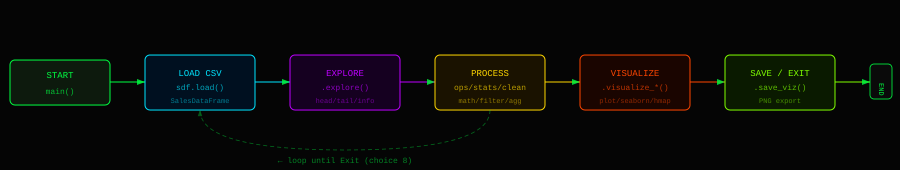

</div>

---

## `// 11` · OOP PRINCIPLES APPLIED

<div align="center">

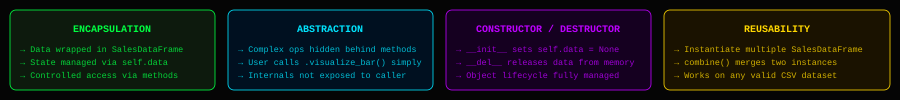

</div>

---

## `// 12` · ASSUMPTIONS

- Dataset must be in **CSV format** with headers in the first row.
- When no dataset file is found, a **200-row synthetic dataset** is auto-generated at `data/sales_data.csv`.
- Mathematical and statistical operations apply to **numeric columns only**; non-numeric columns are skipped automatically.
- All visualizations default to `plt.show()` in CLI mode; in Jupyter, `%matplotlib inline` is active.
- Missing value handling is **non-destructive** by default — the user selects the strategy interactively.

---

<div align="center">


</div>
